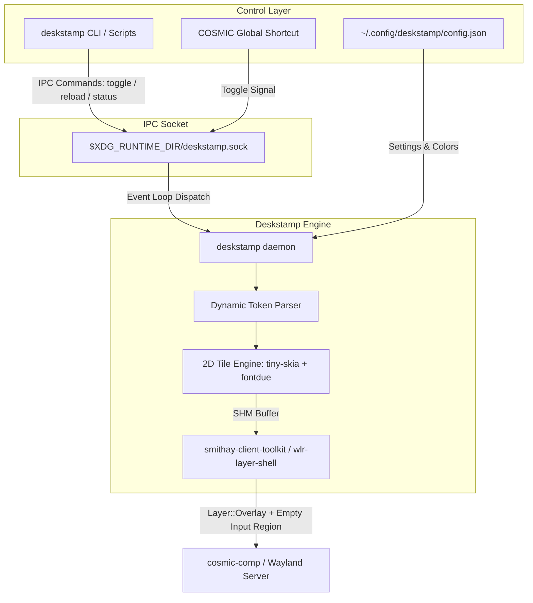

<p align="center">
  
</p>

<h1 align="center">Deskstamp</h1>

<p align="center">
  <strong>Native, high-performance desktop watermark overlay for Linux & Pop!_OS COSMIC.</strong><br>
  <em>Real-time screen watermarking with seamless click-through, zero idle CPU overhead, and dynamic token interpolation.</em>
</p>

<p align="center">
  <a href="https://github.com/GabrielBaiano/Deskstamp"></a>
  <a href="https://wayland.freedesktop.org/"></a>
  <a href="https://www.rust-lang.org/"></a>
  <a href="https://flathub.org/"></a>
  </p>

---


## 🌟 Introduction

**Deskstamp** is a lightweight, real-time desktop watermark utility designed specifically for **Pop!_OS 24.04 COSMIC** and modern Wayland desktop compositors.

Inspired by macOS utilities like Deskmark, Deskstamp allows streamers, educators, enterprise developers, and confidential content creators to stamp their screens in real-time. Whether you are streaming on Twitch/YouTube, recording meetings via OBS/PipeWire, or working on confidential NDA builds, Deskstamp protects your screens from unauthorized leaks without requiring post-production video editing.

---

## ✨ Key Features

- **True Wayland Click-Through**: Uses Wayland's empty input region protocol (`wl_surface.set_input_region(None)`). Mouse clicks, scrolling, hover states, and keyboard shortcuts pass straight through to whatever application is beneath the overlay with zero latency.
- **Zero Idle CPU Consumption**: Uses native Wayland damage tracking. When rendering static watermarks, the engine draws once into a shared memory (`shm`) buffer and sleeps indefinitely (0.0% CPU).
- **Dynamic Real-Time Tokens**: Supports environment variable expansion including `{user}`, `{hostname}`, `{date}`, and custom `{time:%H:%M:%S}` updates.
- **Geometric Grid & Tiling**: Flexible matrix transformations allowing angle rotation, horizontal/vertical spacing, staggered offset (brick/honeycomb pattern), and multi-line alignment.
- **Contrast & Visibility Tuning**: Built-in stroke outlines, shadows, and alpha channel opacity control to guarantee readability over both dark and light windows.
- **IPC Runtime Control**: Local UNIX domain socket allows instant toggle (`on`/`off`), live reload of settings, and status inspection without restarting the process.
- **App Store & Distribution Ready**: Preconfigured with AppStream specifications (`io.github.gabrielbaiano.Deskstamp.metainfo.xml`), desktop entries, and Flatpak manifest.

---

## 🏗️ Architecture



---

## 🚀 Performance

Deskstamp is engineered in Rust for minimal footprint:

| Metric | Measurement | Notes |
| :--- | :--- | :--- |
| **Idle CPU Usage** | **0.0%** | When static, sleeps in calloop event loop with zero wakeups |
| **Clock-Ticking CPU** | **< 0.1%** | Updates only damaged text area once per second |
| **Memory Footprint (RSS)** | **~18 MB** | Shared memory (`shm`) slot pool with zero GPU memory lock |
| **Input Latency Overhead** | **0.0 ms** | Wayland compositor routes pointer events directly to lower surfaces |

---

## 📦 Installation

### 1. Debian / Pop!_OS / Ubuntu (`.deb`)
Download and install the native `.deb` package from the [Releases page](https://github.com/GabrielBaiano/Deskstamp/releases):
```bash
# Download and install via apt
wget https://github.com/GabrielBaiano/Deskstamp/releases/latest/download/deskstamp_0.1.0_amd64.deb
sudo apt install ./deskstamp_0.1.0_amd64.deb
```

### 2. Standalone Tarball (Any Linux x86_64)
```bash
wget https://github.com/GabrielBaiano/Deskstamp/releases/latest/download/deskstamp-v0.1.0-x86_64-unknown-linux-gnu.tar.gz
tar -xzf deskstamp-v0.1.0-x86_64-unknown-linux-gnu.tar.gz
cd deskstamp-v0.1.0-x86_64-unknown-linux-gnu
./install.sh
```

### 3. Build from Source
```bash
# Clone and build with Cargo
git clone https://github.com/GabrielBaiano/Deskstamp.git
cd Deskstamp
cargo build --release
install -Dm755 target/release/deskstamp ~/.local/bin/deskstamp
```

---

## 🛠️ Usage Examples

### 1. Fast Test Mode (5-second overlay)
Quickly test the watermark and click-through on your current active screen:
```bash
deskstamp test
```

### 2. Start Background Daemon
Run the overlay service:
```bash
deskstamp daemon &
```

### 3. Toggle Visibility at Runtime
Bind this command to a shortcut in COSMIC Desktop Settings (`Settings -> Keyboard -> Shortcuts`):
```bash
deskstamp toggle
```

### 4. Reload Configuration
After editing your JSON config, reload instantly without killing the overlay:
```bash
deskstamp reload
```

### 5. Export Watermark Preview Image
Generate a high-resolution PNG preview of the current layout:
```bash
deskstamp preview watermark_sample.png
```

---

## ⚙️ Configuration Reference

On first launch, Deskstamp creates a default configuration file at `~/.config/deskstamp/config.json`:

```json
{
  "text": "CONFIDENTIAL • {user}@{hostname} • {time:%H:%M:%S}",
  "font_size": 22.0,
  "angle_deg": -25.0,
  "opacity": 0.18,
  "color_rgba": [255, 255, 255, 255],
  "spacing_x": 420.0,
  "spacing_y": 220.0,
  "stagger_offset": 210.0,
  "stroke_width": 1.0,
  "stroke_color_rgba": [0, 0, 0, 180],
  "font_path": null,
  "active": true,
  "update_interval_secs": 1
}
```

### Options Breakdown
- `text`: Template string containing static text and dynamic tokens.
- `font_size`: Font size in logical points.
- `angle_deg`: Diagonal rotation in degrees (negative tilts upwards).
- `opacity`: Overall watermark opacity (0.0 = invisible, 1.0 = opaque).
- `color_rgba`: Text color array in `[R, G, B, A]` (0-255).
- `spacing_x` / `spacing_y`: Horizontal and vertical distances between watermark instances.
- `stagger_offset`: Alternating row offset to form brick/honeycomb patterns.
- `stroke_width` & `stroke_color_rgba`: Outline thickness and color for contrast.
- `update_interval_secs`: Frequency of dynamic clock token redraws.

---

## 🏷️ Dynamic Tokens

You can include dynamic system tokens inside your `text` configuration:

| Token | Output Description | Example |
| :--- | :--- | :--- |
| `{user}` | Current logged-in user | `gabriel` |
| `{hostname}` | Machine system hostname | `pop-os` |
| `{date}` | Current date (`YYYY-MM-DD`) | `2026-09-22` |
| `{time}` | Current time (`HH:MM:SS`) | `14:30:15` |
| `{date:FORMAT}` | Custom Chrono date format | `{date:%b %d, %Y}` → `Sep 22, 2026` |
| `{time:FORMAT}` | Custom Chrono time format | `{time:%I:%M %p}` → `02:30 PM` |

---

## 💻 Development & Testing

### Running Tests
```bash
cargo test
```

### Checking Formats and Linting
```bash
cargo check
cargo clippy
```

---

## 🗺️ Roadmap

See [ROADMAP.md](./ROADMAP.md) for full future development plans.
- [x] Wayland Layer-shell implementation with click-through.
- [x] Dynamic token parser (`{user}`, `{hostname}`, `{time}`).
- [x] UNIX socket IPC control (`toggle`, `reload`).
- [ ] SVG logo and image watermark support via `resvg`.
- [ ] Native `libcosmic` settings GUI with live interactive canvas.
- [ ] COSMIC top bar applet for one-click toggling.
- [ ] Forensic steganographic watermark mode for enterprise leak tracing.

---

## 🤝 Contributing

Contributions make the open-source community an amazing place to learn, inspire, and create. Any contributions you make are **greatly appreciated**.

Please see [CONTRIBUTING.md](./CONTRIBUTING.md) for detailed guidelines.

---

## 💬 Community & Support

- **Issues**: [GitHub Issue Tracker](https://github.com/GabrielBaiano/Deskstamp/issues) (Bug reports and feature proposals)

---


## 📄 License

Distributed under the **GPL-3.0-or-later** License. See `LICENSE` for more information.

---

<p align="center">
  Made with ❤️ and the help of <a href="https://github.com/GabrielBaiano/awesome-readme">Awesome-Readme</a> by <a href="https://github.com/GabrielBaiano">Gabriel Baiano</a>
</p>
